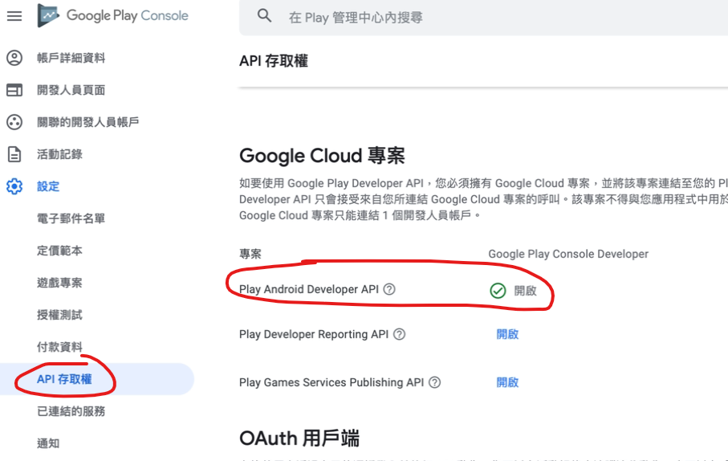
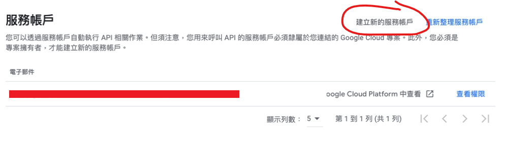
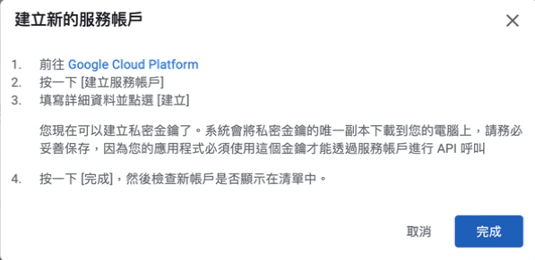
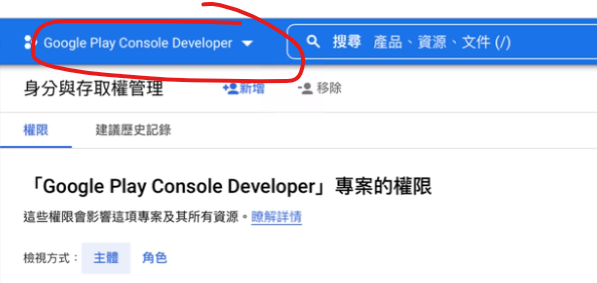
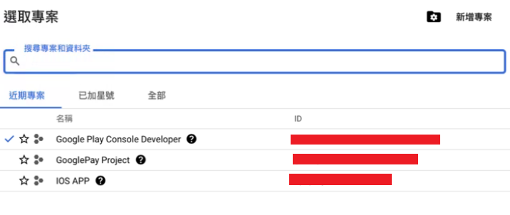
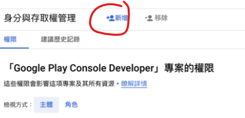
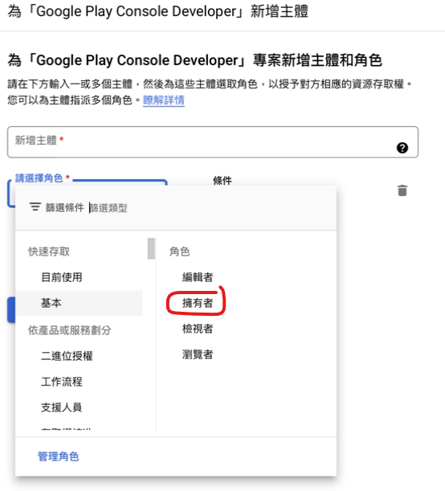
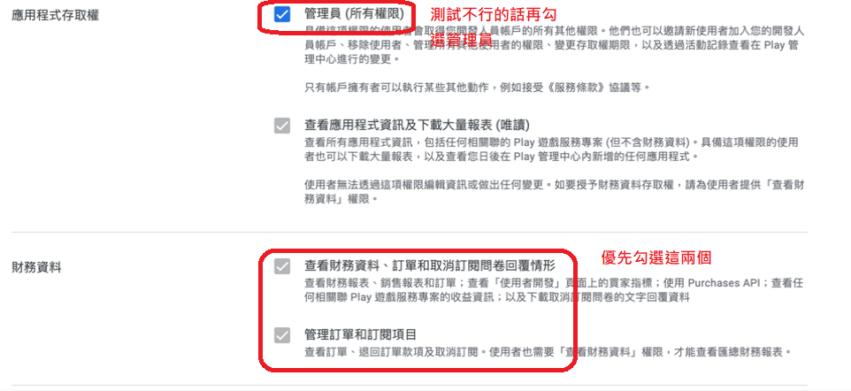
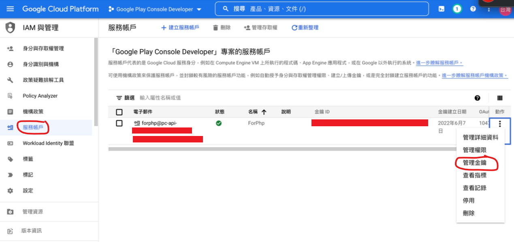
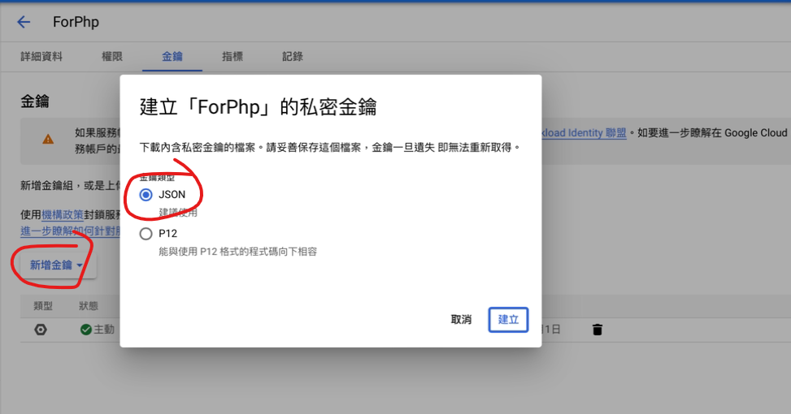

# Google JSON 金鑰申請

## 參考文章（前半部分）:

- [YouTube教學1](https://www.youtube.com/watch?v=OG5t20a2ZUo&ab_channel=PeaceGrowba)
- [YouTube教學2](https://www.youtube.com/watch?v=DVZFSZkpOSs&ab_channel=TECHUBB)
- [Coder.work 文章](https://www.coder.work/article/7042899)
- [Google Android Publisher API 參考](https://developers.google.com/android-publisher/api-ref/rest/v3/purchases.products)
- [教學文章1](https://iter01.com/639684.html)
- [教學文章2](https://ithelp.ithome.com.tw/articles/10232395)
- [Google Android Publisher 授權](https://developers.google.com/android-publisher/authorization)
- [教學文章3](https://www.twblogs.net/a/5b89b0722b71775d1ce33d0a)
- [Stack Overflow 討論](https://stackoverflow.com/questions/43536904/google-play-developer-api-the-current-user-has-insufficient-permissions-to-pe)
- [Google Cloud 認證入門](https://cloud.google.com/docs/authentication/getting-started#auth-cloud-implicit-php)
- [Google 認證範圍](https://developers.google.com/identity/protocols/oauth2/scopes)

## Google Play Console 的 API

### 選擇 API 存取權

1. 選擇 Play Android Developer API



2. 新增服務帳號



3. 在建立帳號的過程中，您需要向自己的服務帳號授予對 Cloud 專案的訪問許可權，這樣它才能顯示在 Google Play 管理中心內。



4. 點選 Google Cloud Platform 建立，先將 Google Play 專案和自動建立的 Cloud Platform 專案繫結



5. 選取專案



6. 建立服務帳號



7. 選擇權限 -> 基本 -> 擁有者



8. 回到 Google Play Console -> API 存取權 -> 服務帳戶 -> 查看權限
   根據 Stack Overflow 的文章，需要設定財務資料的訪問權限，如果測試中不行的話再選擇管理員（所有權限）



9. 接著到 Google Cloud Platform -> 服務帳戶 -> 選擇動作 -> 管理金鑰



10. 建立金鑰 -> 選擇 JSON 格式並保存下來，Google SDK 會使用到



## 安裝 Google SDK

GitHub: [https://github.com/googleapis/google-api-php-client](https://github.com/googleapis/google-api-php-client)

使用 Composer 安裝，在專案中的 composer.json 中執行以下指令（在 dodowala 的 app 目錄下）：

```bash
composer require google/apiclient:^2.12.1
```

安裝成功後，composer.json 中會出現 "google/apiclient": "2.12.1"

然後在程式中引用以下程式碼即可使用：

```php
require_once __DIR__ . '/../../vendor/google/apiclient-services/autoload.php';
```

## PHP 的 JSON 金鑰使用

以下是使用 JSON 金鑰向 Google 取得收據的 PHP 程式碼示例：

```php
// 使用 app 回傳訊息向 Google 取得收據
public function getProducts($token, $productId){
    putenv("GOOGLE_APPLICATION_CREDENTIALS=$this->dirJson");
    $android = new AndroidPublisher();
    $android->getClient()->useApplicationDefaultCredentials();
    $android->getClient()->addScope('https://www.googleapis.com/auth/androidpublisher');
    $android->getClient()->setHttpClient(new Client(array('verify' => false)));
    $this->service = new Google_Service_AndroidPublisher($android->getClient());
    try {
        $purchase = $this->service->purchases_products->get($this->packageName, $productId, $token);

        return $purchase;
    }catch (Exception $e){
        #var_dump($e->getMessage());
        return false;
    }
}
```

注意事項：

- 使用 API 可能有單日 20 萬次限制
- `$dirJson` 為 JSON 目錄位置
- 將 JSON 目錄加入到環境變數 "GOOGLE_APPLICATION_CREDENTIALS" 中，Google SDK 會自動使用，參考[這篇文檔](https://cloud.google.com/docs/authentication/getting-started#verifying_authentication)
- `useApplicationDefaultCredentials()`：使用設定好的 JSON 金鑰
- `addScope()`：使用 Android 使用的 API 網址，參考[這篇文檔](https://developers.google.com/identity/protocols/oauth2/scopes#androidpublisher)
- `setHttpClient()`：將 SSL 驗證取消
- 使用設定好的連線 client 向 Google 請求收據